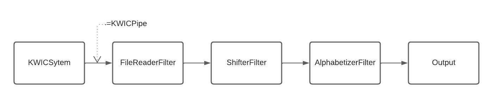

# KWIC Index System
KWIC (*Keyword In Context*) Index System for SE-311 at Drexel University

## Author
Cole Hoener
colehoener@gmail.com or cth59@drexel.edu

## UML Class Diagram

    
 

 
 ## Pipe-Filter Diagram

    
 

## Instructions

1. Open the project in IntelliJ IDE and run KWICSystem as '*Main*'
2. Enter in the text file (full file name) you wish to use as input
3. Results are printed to the file '**output.txt**'

## Important Files
1. **stopWords.txt** : A file that contains all the stop words. This file is always read. Update the list to add or remove stop words. To have no stop words, leave the file empty.
2. **input.txt** : This is a sample file that can be used to test the system
3. **output.txt** : This file is cleared and the results of the last system process are written to this file.

### Known Bugs
Currently, there are no known bugs for the system.

### Notes
1. The output formatting is slightly different than the example given in the assignment details document. I change the output due to changing word/sentence sizing and for easier reader.
2. The output that is alphabatized is alphbatized based on the first word of the '*value*'
3. If you wish to add more input files, they must be placed in the '*./Input* folder.

## Version History
#### 1.0.0
Intial system constructed. Able to read, shift, alphabetize, and write to file.
Known Issues: Does not properly handle multiple lines.

#### 2.0.0
Updated system architecture to use a pipe and filter style. New UML diagram added and class diagram updated.
THe pipe and filter style used here allows everything to be controlled by the KWICPipe object. This allows every module (step) in the system to act on its own, and filter the data. This creates less coupling between modules. 
